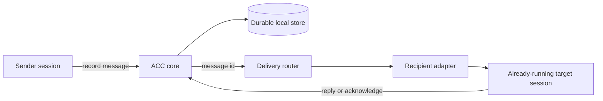

# ACC v0.2: Communication First

- **Status:** approved design
- **Date:** 2026-09-01
- **Target:** the next ACC release

## Summary

ACC v0.2 is an open, local-first, vendor-neutral communication layer for
independently opened AI coding sessions. It connects sessions the user already owns; it
does not create or manage an agent team.

The release deliberately removes orchestration concepts from the product, rebuilds peer
communication around durable message threads and truthful delivery receipts, and adds an
optional path for messages to reach already-running sessions through official client APIs.
Claims remain useful but secondary. Communication is the product.

This is a clean protocol break. There is no v0.1 data migration and no migration code.
The only current user is the maintainer, who will reset local ACC runtime data before using
v0.2. New code must reject an incompatible store version rather than guess at old records.

## Product boundary

> Competitors create and control teams of agents. ACC connects agents that already exist
> and remain independently owned.

ACC owns:

- workspace-local peer discovery and presence;
- participant and session identity;
- current intent;
- advisory or guarded resource claims;
- durable conversations, messages, replies, acknowledgements, and delivery evidence;
- adapter-specific delivery through capabilities proven on real clients.

ACC does not own:

- process launch, resume, termination, or supervision;
- model selection, token budgets, prompts, permissions, or approvals;
- task decomposition, task graphs, work queues, or a team lead;
- worktree creation, merging, CI, or source-control workflow;
- raw transcripts or shared model memory;
- hosted or multi-machine coordination.

If a transport requires ACC to own the target session lifecycle, that transport does not
belong in ACC.

## Product contraction

The following concepts and public operations are removed:

- workstreams;
- coordinator roles and leases;
- tasks and dependency graphs;
- task state transitions;
- standalone decision records;
- standalone handoff records;
- `acc task`;
- `acc workstream`;
- `acc decide`;
- MCP task and workstream tools and resources;
- adapter execution capabilities for launch, resume, and terminate;
- the `wakeDormantSession` capability.

The following public operations remain:

```text
acc status
acc work
acc claim
acc release
acc message
acc request
acc inbox
acc reply
acc ack
acc finish
acc sync
acc doctor
acc install
acc update
acc uninstall
```

`acc request` is command-line convenience for a message that expects a reply. It creates no
task. `acc finish` writes a structured handoff message, releases the session's claims, and
ends that session's ACC participation. It never closes or controls the external client
session.

## Component architecture



### Protocol

`protocol` defines the vendor-neutral record shapes, events, state machines, error codes,
and validation. It contains no client names and no execution concepts.

### Core

`core` owns workspace, participant/session, intent, claim, conversation, message, and
receipt rules. It records a message before delivery is attempted. It does not import an
adapter, Git, the filesystem, or `node:child_process`, and it never invokes a model.

### Storage

The filesystem store remains the durable source of truth. All state stays in platform app
data outside every repository. The existing transaction, journal, recovery, and mutex
contracts remain in force.

### Delivery router

The router is a small layer above core. Given an already-recorded message, it resolves one
eligible target session, checks recipient policy and certified adapter capabilities, asks
the adapter to offer the message, and records the outcome.

The router is not a coordinator and does not require a central daemon. It can run inside a
CLI or MCP call, a hook process, or a client-owned channel subprocess. A future broker is
allowed only as a replaceable transport implementation; it may not own durable state or
session lifecycle.

### Adapters

Adapters attach sessions, project next-turn context, guard supported writes, publish
ephemeral delivery bindings, and optionally implement live delivery. Vendor-specific code
stays in `adapter-*` packages.

## Conversation protocol

### Threads

The first message is the thread root and uses its own id as the thread id:

```text
threadId = root messageId
```

Replies carry the same `threadId` plus `inReplyTo`. There is no mutable thread record or
thread status. Unresolved work is derived from per-message obligations and receipts.

### Message envelope

Every message contains:

```text
messageId
threadId
clientMessageId
workspaceId
fromParticipantId
fromSessionId
toParticipantIds
kind
obligation
subject
body
inReplyTo
artifacts
sentAt
```

`clientMessageId` is an idempotency key supplied by the caller. Repeating a send after a
timeout or crash with the same key returns the original logical message rather than
creating another one. The key is scoped to `workspaceId + fromParticipantId`; reusing it
with different message content is an error. CLI and MCP boundaries generate a fresh key
when the caller omits one and expose the key in their result so an uncertain caller can
retry explicitly.

`toParticipantIds` is non-empty for addressed communication. An empty list means a
workspace-room record: it creates no recipient receipts, has obligation `none`, and is not
eligible for live push. Only `note`, `decision`, and `handoff` may be room records.

### Message kinds

| Kind | Meaning |
|---|---|
| `note` | Information with no expected response |
| `question` | A question that expects an answer |
| `request` | A request for action and a returned result |
| `answer` | A reply within an existing thread |
| `decision` | A durable decision communicated to peers |
| `handoff` | Structured context transferred to another participant |

The independent obligation is one of:

```text
none
acknowledge
reply
```

The valid combinations are deliberately small:

| Kind | Valid obligation |
|---|---|
| `note` | `none` |
| `question` | `reply` |
| `request` | `reply` |
| `answer` | `none` |
| `decision` | `none` by default; the sender may explicitly choose `acknowledge` when addressed |
| `handoff` | `acknowledge` when addressed; `none` as a room record |

The schema rejects every other combination rather than silently reinterpreting it.

A request has no accepted/in-progress/done state. Agents communicate acceptance and
results in the thread; ACC does not track execution. A reply resolves the communication
obligation only. It is not evidence that the requested action finished.

### Per-recipient receipts

Each addressed `message + recipient` pair has an independent receipt:

```text
queued -> offered -> retrieved -> acknowledged
```

- `queued`: the durable message and receipt committed successfully;
- `offered`: bytes crossed the ACC-side transport boundary or the target client accepted
  the native delivery call;
- `retrieved`: the participant explicitly read the message through the inbox or an adapter
  produced an equally strong certified acknowledgement;
- `acknowledged`: the participant explicitly acknowledged the message or replied.

Forward skips are legal when the stronger event implies the weaker ones. Backward moves
are never legal. Repeating a state is idempotent.

There is no `seen` state: ACC cannot observe model attention. There is no terminal `failed`
state: a failed live acceleration does not make a durable message undeliverable.

### Offer attempts

Delivery attempts are immutable events rather than receipt states:

```text
message.offer_succeeded
message.offer_failed
```

An attempt records the message, recipient session generation, transport, adapter,
certified client version, timestamp, and a stable safe error code where applicable. It
never records peer content in logs.

The commit order is part of the contract:

1. record message and `queued` receipt;
2. prepare the adapter payload;
3. write to the transport or receive native-client acceptance;
4. commit `offered` and the successful attempt event.

A crash between steps 3 and 4 may cause a duplicate offer. That is acceptable underclaim.
Advancing before step 3 would be a false delivery claim and is forbidden.

### Reply and acknowledgement

`acc reply --message <id>` atomically verifies recipient ownership, records an `answer` in
the same thread, and acknowledges only that participant's receipt for the original
message. After that transaction commits, the router may try to offer the answer to the
original author. A transport failure cannot roll back the durable reply.

`acc ack --message <id>` acknowledges without creating a reply. One recipient can never
advance another recipient's receipt.

### Handoff

`acc finish` creates a `handoff` message with structured `completed`, `remaining`,
`blockers`, `verification`, and `artifacts` content, then releases the sender session's
claims and ends its ACC presence. With no recipient, the handoff is a room record. With a
recipient, it requires an acknowledgement. Neither form terminates, suspends, or otherwise
controls the external client session.

### Attention

The attention vocabulary becomes:

- `reply_required`;
- `acknowledgement_required`;
- `recipient_unavailable`;
- `claim_conflict`;
- `claim_contended`;
- `claim_expired`.

Task and coordinator attention kinds are removed. A sender may be told that a required
recipient is unavailable, but ACC does not infer whether work is stalled.

## Delivery contract

### Adapter capabilities

The delivery capability vocabulary is:

```text
delivery.nextTurn
delivery.livePush
delivery.replyRoute
```

`nextTurn` offers peer data at a normal client turn boundary. `livePush` uses an official
client API to offer data to an already-running session. `replyRoute` provides a native
path back to the originating ACC thread.

Lifecycle, context, and guard capabilities remain where they describe observed client
behavior. Execution capabilities are removed.

Every `true` delivery capability must be derived from machine-readable certification
evidence containing:

```text
client
version
platform
observedAt
capability
fixture provenance
idle behavior
busy behavior
authority level
known limitations
```

An unknown or uncertified client version degrades to a weaker mode. A method existing in
source is necessary but not sufficient evidence.

### Recipient policy

Live delivery is recipient-owned because it can start a model turn and spend tokens:

```text
off
actionable
all
```

- `off`: next-turn and inbox only;
- `actionable`: questions, requests, and addressed handoffs may use live delivery;
- `all`: every addressed message kind may use live delivery.

The default is `off`. Installation may offer to enable it, but never enables it silently.
The current setting and effective delivery mode are visible in `acc status`.

### Ephemeral delivery bindings

An adapter may publish this ephemeral, generation-bound binding outside the repository:

```text
sessionId
generation
adapterId
clientVersion
availableModes
opaqueEndpointRef
leaseUntil
```

Core sees available modes but never interprets `opaqueEndpointRef`. Only the owning adapter
does. The lease prevents a restarted session from inheriting a stale endpoint.

Capability and current reachability are separate. A client can support live delivery while
a particular session is opted out, unreachable, ambiguous, or running an uncertified
version.

Messages are addressed to participants. The router may attempt live delivery only when
exactly one current session generation is eligible. Multiple active sessions for one
participant are ambiguous and therefore use durable fallback.

### At-least-once behavior

ACC guarantees durable recording, stable message ids, idempotent send retries, and a
recoverable path. It does not claim exactly-once display inside vendor clients.

Every adapter payload carries the original message id. After a successful live offer, a
next-turn projection shows only a compact unresolved breadcrumb instead of repeating the
entire body. If the vendor silently dropped the live event, the body remains recoverable
with `acc inbox --message <id>`.

## Native delivery targets

### Codex

The feasibility target is the official app-server `turn/start` operation with a standalone
`toolOutput` and empty user input. This representation retains tool-tier authority and can
start a regular turn without pretending that ACC can join or steer an active one.

ACC will use it only for a certified, already-running, idle, user-owned session. It will
not steer an active turn. If the target is busy, in review, compacting, closed, or
ambiguous, the message stays queued for a later safe path.

The Codex spike passes only if ACC can address the exact existing session without starting
an ACC-owned Codex process. It must capture the offered message id, authority tier, idle
behavior, busy behavior, reply path, duplicate retry behavior, and fallback.

Primary documentation:

- <https://github.com/openai/codex/blob/main/codex-rs/app-server/README.md>

### Claude Code

The feasibility target is a two-way Claude Channel implemented as a session-owned MCP
subprocess. It reads unresolved ACC messages, emits `notifications/claude/channel` with
message and thread metadata, and exposes narrow reply and acknowledgement tools.

The channel must not declare permission relay, open a network listener, collect a
transcript, or introduce a runtime dependency. It should reuse ACC's existing Node
built-in MCP patterns.

Claude Code does not acknowledge channel notifications. A successful stdio write therefore
means only `offered`. Custom Channels remain preview and opt-in, so capability documentation
must name that limitation without upgrading it to a stable promise.

Primary documentation:

- <https://code.claude.com/docs/en/channels-reference>

### Other clients

Gemini CLI and Kimi Code keep certified next-turn delivery. Grok keeps inbox/polling unless
a real client capture proves more. Generic MCP remains a polling participation tier.

All clients share the same conversation and receipt semantics. Only latency and available
transport differ.

## Safety and failure behavior

- Peer content is always attributed and framed as untrusted data.
- Live delivery cannot change permissions or approve tools.
- ACC does not simulate terminal input or edit transcript files.
- No runtime endpoint or token is written into a repository.
- Runtime endpoints use local, user-only permissions and no externally reachable socket.
- A transport failure after durable recording is reported but does not fail the send.
- A store failure before durable recording fails the send and attempts no transport.
- Unknown versions and ambiguous targets degrade visibly.
- Hook paths remain fail-open within their fixed budget.
- Raw transcripts remain excluded.

## Clean protocol break

There is no v0.1 migration, compatibility reader, archival path, or transitional command.
v0.2 uses its own store version and refuses a v0.1 store. The maintainer resets existing
local ACC runtime data once before installing v0.2. Product code must not silently delete
or reinterpret an old store.

This choice is justified only because there are no external users. It removes migration
work that would not improve the shipped product.

## Verification strategy

### Scope removal

Surface tests must prove that task, workstream, coordinator, standalone decision, and
execution APIs are absent from core, CLI, MCP, installed skills, docs, fixtures, and the
packed artifact. A mutation that restores one removed operation must fail the gate.

### Conversation and receipt mutations

Tests must fail when any of these defects is introduced:

- a receipt advances before bytes cross the transport boundary;
- a receipt moves backward;
- one recipient advances another recipient's receipt;
- a retry creates a second logical message;
- an offered message is called retrieved without explicit evidence;
- a reply is created outside the original thread;
- peer content escapes its untrusted frame;
- a full body is silently truncated or lost under the context budget.

### Adapter certification

Conformance must reject a `true` capability with no matching real-client evidence. It must
also reject mismatched client versions, copied documentation examples presented as
captures, and missing idle/busy/fallback outcomes.

### Codex real-client proof

The installed artifact must prove idle live offer, busy non-interruption, exact target
selection, tool-tier authority, reply routing, duplicate retry, restart fallback, and
unknown-version downgrade. Disabling the bridge must make the live test fail while the
durable fallback still passes.

### Claude real-client proof

The installed artifact must prove channel registration, inbound offer, correct metadata,
reply routing, no permission capability, disabled-channel fallback, restart behavior, and
the absence of false retrieved/acknowledged states.

### Cross-vendor acceptance

The release's defining scenario is:

```text
Claude asks Codex a project question
-> Codex receives it without human relay
-> Codex replies in the same ACC thread
-> Claude receives the answer
```

The inverse direction must also work. When live transport is disabled, the same scenario
must complete through next-turn or inbox without changing message semantics.

### Installed artifact

The final gate runs the documented commands against `npm pack`, installs the tarball into a
clean environment, wires real clients, exercises communication and claims, verifies
restart recovery and clean uninstall, and confirms that the packed README links resolve.

The standard repository gate remains:

```bash
npm run check
npm test
npm pack
node scripts/verify-package.mjs
```

Where the machine's default npm cache is not writable, tests use a dedicated cache under a
temporary directory rather than changing ownership of the user's cache.

## Dependency-ordered execution plan

Implementation planning must decompose this design in this order:

1. Run throwaway Codex and Claude feasibility spikes against installed real clients.
2. Remove orchestration concepts and assert the smaller public surface.
3. Replace message, thread, obligation, receipt, and attention schemas.
4. Implement idempotent core conversation operations and atomic reply/finish flows.
5. Move next-turn delivery to the honest offer-then-commit seam.
6. Implement capability evidence manifests and conservative version downgrade.
7. Implement ephemeral delivery bindings and the delivery router.
8. Productionize only native transports that passed the spikes.
9. Update CLI, MCP, installed skills, docs, and deterministic onboarding.
10. Prove the cross-vendor scenario and the packed installed artifact.
11. Run the full release gate and publish v0.2 when every technical proof passes.

There is no calendar-based beta sequence. Phases are ordered by dependency and completed
only when their verification gate passes.

## Release outcome

The release is complete when:

- the product surface contains no orchestration subsystem;
- all message and receipt claims match observable evidence;
- direct delivery never requires ACC-owned sessions;
- Codex and Claude expose only the capability level real clients proved;
- every supported client retains a durable fallback;
- the cross-vendor question-and-answer scenario works without human relaying;
- the installed tarball passes the complete gate;
- documentation leads with communication between sessions, with claims as supporting
  coordination rather than the product definition.

After release, adoption work can seek external users and measure the real activation event:
a second session completes a useful acknowledged interaction without the human relaying it.
That research does not block implementing the complete, evidence-backed product defined
here.
