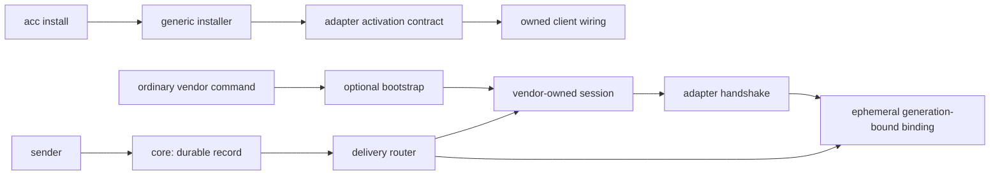

# Transparent native delivery for ACC

- **Status:** approved design
- **Date:** 2026-09-02
- **Target:** the next ACC feature release after 0.2
- **Supersedes:** only the native live-delivery activation and exact-version routing rules
  in [ACC v0.2: Communication First](2026-09-01-acc-v0.2-communication-first-design.md)

## Decision

ACC will offer explicitly addressed peer messages to already-running AI client sessions
through each client's own transport. Users will continue to start Claude Code, Codex,
Grok, Gemini CLI, and Kimi Code with their normal commands. An interactive `acc install`
may opt supported clients into native delivery by installing a reversible shell bootstrap
or changing a native client setting. ACC will not launch, own, supervise, resume, or stop
an agent session.

Native delivery is an acceleration over the durable inbox, never a second source of truth:

```text
record durably -> resolve one current binding -> offer through the native transport
```

Every failure after the durable commit leaves the message recoverable. ACC does not invent
a portable session-control protocol and does not replace ACP or a vendor protocol. It is a
router over those transports plus the cross-client presence, addressing, trust, receipt,
and fallback semantics they do not provide.

## Why this is still ACC, not an orchestrator

The product boundary remains:

> ACC connects independently opened sessions. It does not create or control them.

The optional bootstrap may do four things only:

1. locate the real vendor executable;
2. add adapter-approved arguments or environment;
3. replace itself with that executable using `exec`;
4. fall back to the unmodified executable when ACC cannot establish compatibility.

It may not create a session, choose a model, supply a task prompt, manage permissions or
worktrees, keep a parent supervisor alive, restart a client, or inspect a transcript.
There is no `acc run` command.

A vendor may itself own an ACC transport child, as Claude Code owns a Channel subprocess.
That child is scoped to the vendor session, does not launch or supervise the model, and
dies with its parent. A vendor-owned transport child is compatible with this boundary; an
ACC-owned parent process around the vendor client is not.

## Goals

- Let one ACC participant ask another participant a question and receive the answer
  without requiring another human turn.
- Preserve ordinary `claude`, `codex`, and other native launch commands.
- Ask for explicit, per-client consent during interactive installation.
- Admit newer client versions automatically when they preserve a captured protocol
  contract.
- Reject clients below the minimum, explicitly known-bad releases, failed probes, and
  failed session handshakes without breaking the vendor client.
- Keep vendor facts in adapter packages and core vendor-neutral.
- Distinguish eligibility, configuration, current reachability, transport acceptance,
  retrieval, and acknowledgement.
- Prove native behavior in real clients and in the installed tarball.

## Non-goals

- Agent launch, process supervision, scheduling, or task execution.
- Model, prompt, token-budget, permission, or source-control management.
- Interrupting, steering, or cancelling an active model turn.
- Transcript collection or inference of replies from model output.
- Remote or cloud relay, telemetry, or a hosted ACC control plane.
- Reimplementing ACP or a vendor transport.
- Automatically updating vendor clients.
- Claiming live support on an uncaptured operating system.
- Adding a UI, dashboard, or urgency system.

## User experience

### Interactive install

When stdin and stdout are TTYs and `--delivery` was omitted, `acc install` performs a
read-only detection pass before asking anything. The report separates present clients,
versions, native-delivery eligibility, and existing ACC wiring:

```text
AI clients detected:

Claude Code  2.1.258  Live delivery available (experimental)
Codex        0.152.1  Live delivery available (experimental)
Grok         1.0.13   Awaiting compatibility capture
Gemini       0.57.0   Next-turn delivery only
Kimi         -        Not installed

Enable live delivery for Claude Code? [y/N]
Enable live delivery for Codex? [y/N]
```

ACC asks only for an adapter that can produce an eligible activation plan. Each question
names the mechanism and the files or native service it will affect. The default is `No`
because prepending a shim directory or changing client configuration is a material local
change.

The existing delivery option remains the only automation surface:

```bash
acc install --delivery off
acc install --delivery actionable
acc install --delivery all
acc install --adapter codex --delivery actionable
```

An explicit `--delivery actionable|all` applies to every selected eligible adapter and
does not prompt. Repeating `--adapter` remains the granular automation mechanism. A
non-interactive invocation with no explicit delivery option installs ordinary ACC wiring
with live delivery off. `--dry-run` never prompts or writes; without an explicit delivery
option it previews the off plan and says that interactive choices were not made.

The planner accepts a per-adapter delivery-policy map. Interactive answers populate that
map; the explicit CLI option populates it uniformly for selected adapters. This is the
only intentional change from the current planner's single global delivery value.

### Delivery policies

Only explicitly addressed messages are eligible for native delivery. Room records remain
ambient next-turn context and never wake every participant.

`actionable` covers every addressed kind that moves a conversation:

```text
question · request · answer · decision · handoff
```

This deliberately adds `answer` to the current router rule. A system that pushes a
question but makes its answer wait for the next human turn has not implemented live
communication. `all` additionally permits addressed `note` messages. `off` disables the
native offer without disabling hooks, durable messages, or next-turn recovery.

### Bypass

Every generated shim supports an immediate escape hatch:

```bash
ACC_BYPASS=1 claude
ACC_BYPASS=1 codex
```

Bypass performs no probe and executes the unmodified real client. It remains available if
the ACC package, Node runtime, native daemon, or local ACC state is damaged.

## Architecture



### Responsibilities

| Component | Responsibility |
|---|---|
| `protocol` | Vendor-neutral message, receipt, binding-mode, and validation vocabulary |
| `core` | Durable record-first conversations, session generations, and ephemeral bindings |
| `adapter-sdk` | Validated native-delivery compatibility and activation contracts |
| `adapter-*` | Client minimum, captured platform, denylist, feature probe, activation facts, handshake, and offer implementation |
| `installer` | TTY consent, deterministic per-adapter planning, generic shell bootstrap, ownership, apply, and rollback |
| `hook-runner` | Bounded startup/resume handshake and binding publication; always fail open |
| `delivery-router` | Policy, exact target selection, current binding selection, native offer, then receipt commit |
| `cli` | Human and automation UX; no vendor-specific branches |

Core must not import an adapter or branch on a vendor name. The installer may enumerate
adapters, but it interprets only the closed activation vocabulary declared by the SDK.
Vendor commands, flags, config keys, endpoints, and protocol payloads remain inside their
adapter packages.

## Native-delivery adapter contract

An adapter that seeks native delivery declares one optional contract alongside its
existing manifest. The SDK validates and freezes it. The contract supplies:

- a minimum stable client version per captured platform;
- one or more passing platform anchor captures;
- a narrow local denylist of exact versions or closed version intervals, each with a
  reason;
- a bounded read-only feature probe;
- an activation description made of closed installer mechanisms;
- a runtime session handshake;
- the existing `offerMessage()` method and, where supported, `routeReply()`.

The activation description can request these mechanisms:

- `shell-bootstrap`: add adapter-declared launch arguments or environment through a
  generic ACC-owned executable shim;
- `native-config`: ask the adapter's existing install path to merge a client-owned
  setting;
- `native-service`: use a vendor-supported bootstrap or teardown command and record
  whether ACC caused it to exist.

One adapter may combine mechanisms. Codex, for example, may need a native daemon plus a
shell bootstrap; Grok may need native config only. The generic installer owns shell-file
editing and ownership rules. An adapter owns the semantics of its native config and
service commands.

A native service command is never run during detection or dry-run. Its plan names the
vendor command, intended state change, pre-existing-state check, and supported rollback;
only apply may execute it after consent.

The feature probe returns only closed facts:

```text
supported | unsupported
observed client version
protocol revision or feature identifiers
executable fingerprint
supported binding modes
safe reason code
```

Free-form diagnostics may explain a closed reason, but the installer and router never
parse diagnostic text to make a decision.

### Compatibility rule

Native delivery is eligible only when all of these are true:

```text
the platform has a passing anchor capture
AND client version >= adapter minimum
AND client version is not denied
AND the current executable passes the bounded feature probe
```

There is no maximum version. A newer client on a captured platform is admitted when it
advertises the same protocol revision or feature set and the live session completes the
handshake. A version string alone never creates a live capability.

Stable SemVer releases are ordered normally. A prerelease is ineligible unless a passing
capture or an explicit adapter compatibility entry admits it; it is not silently treated
as the corresponding stable release.

The current exact-version certification rule remains in place for hooks, guards, and
next-turn injection. This design changes native `delivery.livePush` and
`delivery.replyRoute` evaluation only. Those native capabilities need a passing platform
anchor plus current probe and handshake instead of one allowlist row for every vendor
patch release.

The delivery router stops recomputing exact native capability from the binding's client
version. A binding can exist only after the adapter contract, current probe, and handshake
have all passed. The router still verifies that the loaded adapter declares the native
capability and owns the binding.

### Probe cache and client updates

The ACC-owned activation record stores the real executable path, resolved target,
version, inexpensive file identity (device/inode where available, size, and modification
time), probe result, and selected policy. It stores no environment contents or
credentials.

A shim compares the current executable identity with that record. If it is unchanged, it
uses the cached compatibility result. If the path, symlink target, or file identity
changed, it probes before adding an integration flag. A failed or timed-out probe executes
the plain client. ACC never discovers incompatibility by first launching a user's client
with a guessed flag.

Transient reachability, such as a missing daemon socket, is checked on every launch and is
not cached as client compatibility.

## Shell bootstrap

The first implementation supports the user's current `zsh` environment on macOS. The
generic mechanism is designed for a later independently captured bash/Linux path, but
uncaptured shells and platforms do not receive live activation.

ACC creates an owned shim directory below its platform data home and prepends it through
one visibly marked block in the appropriate interactive shell file. Paths are quoted so
the macOS `Application Support` location is safe. ACC never writes a shim into a vendor's
installation directory and never replaces a vendor symlink.

The installer resolves and records the real vendor executable before its own shim
directory enters `PATH`. At runtime, discovery excludes the ACC shim directory to prevent
recursion. The shell script retains a last-known real executable fallback so a missing ACC
runtime does not strand the vendor command. Its final action is always an `exec` of the
vendor executable; no ACC supervisor remains.

The managed shell block, shim bytes, activation record, and any created directories are
content-hashed ownership artifacts. If another tool already owns the intended command
path, ACC refuses that activation instead of overwriting it.

## Session handshake and bindings

Installation means `configured`, not `active`. A client becomes active only after the
native transport proves which already-running session it represents.

The startup or resume path is:

1. the normal vendor command opens a user-owned session;
2. the existing hook path attaches or resumes the ACC session generation;
3. the adapter performs a bounded native handshake;
4. the handshake proves the vendor session or thread id, client/protocol facts, endpoint,
   and available modes;
5. the hook runner publishes an ephemeral binding for that exact ACC session generation.

The binding continues to carry an opaque endpoint reference and lease. Its allowed mode
vocabulary is extended to distinguish the umbrella native surface from observable
behavior:

```text
livePush · idleWake · busyQueue · replyRoute
```

`idleWake` means a waiting session can receive a peer envelope and start a new normal
turn. `busyQueue` means the vendor accepts the envelope behind the current turn without
interrupting it. `replyRoute` means a native path can explicitly route an ACC reply; it
never means ACC inferred a reply from transcript text. The existing `livePush` value is
the umbrella required by the router. Adapter diagnostics expose the narrower modes.

A client that proves only `idleWake` can publish that mode. When its session is busy, its
adapter returns `recipient_busy` and the durable receipt stays queued. No adapter may
claim `busyQueue` merely because the current model turn was not interrupted; the capture
must show the queued envelope being presented after that turn.

Bindings remain outside repositories, generation-bound, leased, and endpoint-redacted in
status output. A restart cannot inherit the prior generation's endpoint. Several current
sessions for one participant remain ambiguous; the router leaves the message queued
instead of selecting the newest or most recently active session.

## Offer behavior

For each addressed recipient, the router:

1. reads the current receipt and stops if it is already stronger than `queued`;
2. resolves exactly one current recipient session;
3. resolves exactly one current binding owned by that adapter and generation;
4. checks the per-adapter delivery policy and addressed message kind;
5. asks the adapter to offer the complete attributed peer envelope;
6. advances the receipt only after the transport reports acceptance.

The safe busy behavior is queue-after-current-turn. ACC deliberately excludes
`turn/steer`, cancellation, and mid-reasoning interruption from this design. If a vendor
offers only those operations, it does not qualify as `busyQueue`.

Room messages never enter this router. A failure in one recipient or adapter does not undo
another recipient's durable record or successful offer.

## Trust and peer envelope

Every native transport receives the same conceptual frame:

```text
[ACC peer message - untrusted]

From: codex-AOoO8i
Kind: question
Subject: Schema ownership
Message: message_abc123
Reply required: yes

Can I change the delivery binding schema?
```

The adapter encodes that frame in the native protocol without promoting it to system or
developer authority. Existing escaping rules apply to delimiters, nested strings,
terminal controls, and forged ACC labels. A body that cannot fit is withheld as a whole;
the recipient receives the stable id and `acc inbox --message <id>` recovery instruction.

Peer messages never carry permission approval. A `request` remains untrusted peer input,
not an order. The recipient keeps its own instruction hierarchy and operating-system
permissions.

## Replies and receipts

The durable receipt lifecycle remains:

```text
queued -> offered -> retrieved -> acknowledged
```

`recorded` describes successful message creation, not a per-recipient receipt. `offered`
means the certified native transport accepted the complete envelope. A vendor operation
named `inject` does not prove model attention and is still only `offered` unless the
adapter has stronger captured evidence. `retrieved` requires an explicit inbox read or an
equivalent captured recipient-side event. `acknowledged` requires the recipient to
acknowledge or reply. ACC exposes no `seen` claim because current clients do not prove
model attention.

An agent answers explicitly:

```bash
acc reply --message message_abc123 --body "Yes; the schema is free."
```

The operation atomically records an `answer` in the original thread and acknowledges the
question. The answer then follows the ordinary record-first router in the opposite
direction. ACC does not parse assistant output to infer an answer.

Native calls use the ACC `messageId` as the vendor idempotency key where the client
supports one. A crash can still happen after vendor acceptance and before ACC commits
`offered`; ACC prefers a possible duplicate over a false delivery claim or message loss.
For a client without native idempotency, the stable message id remains visible in the
frame and the limitation is recorded in its capture.

An already `offered` body is not replayed at the next turn. Existing compact attention
points to the exact unresolved message so it remains recoverable without duplicating the
peer text.

## Client scope

### Claude Code

- Minimum candidate version: `2.1.80`, where Channels first became available.
- Activation: generic shell bootstrap adds the adapter-approved channel flag.
- Current custom-channel path: the ACC plugin requires Claude Code's development-channel
  flag and may show Anthropic's warning or consent UI.
- Runtime ownership: Claude Code launches the channel child; the adapter correlates that
  child with the hook-captured Claude process and completes a session handshake.
- Release label: `experimental` while a custom development channel is required. ACC does
  not suppress or counterfeit vendor consent. An official allowlist or stable third-party
  channel surface is required before the adapter can be labelled stable.

The concrete development flag and plugin identifier remain adapter facts. If a later
Claude release offers the official channel flag for the installed ACC plugin, the probe
may select it without changing the installer or core.

`2.1.80` is the research lower bound, not automatically the shipped minimum. If the first
passing ACC capture is newer and no real or authoritative protocol evidence covers the
older releases, the adapter minimum is that first passing version. The implementation may
lower it only with evidence; it may not extrapolate backward from a newer capture.

### Codex

- Activation: a vendor-owned app-server daemon plus a generic shell bootstrap that adds
  the supported `--remote` endpoint only while the daemon is healthy.
- Setup uses Codex's own daemon bootstrap command; ACC does not implement or supervise a
  replacement daemon.
- Probe checks the daemon/remote commands and required queue protocol surface before
  activation.
- Handshake must identify the exact running thread. The newest or only visible thread is
  not sufficient evidence.
- Delivery uses the native queue-add operation, not turn steering, and supplies the ACC
  message id as the caller's idempotency key.
- Release label: `experimental` while the remote transport remains experimental upstream.

If the daemon, socket, protocol surface, or thread mapping is absent, the bootstrap starts
plain Codex and no live binding is published. A native daemon that existed before ACC is
never treated as ACC-owned.

### Grok

- Candidate activation: merge the native `[cli] use_leader = true` setting.
- No shell bootstrap is needed if ordinary `grok` attaches to that leader as documented
  by its implementation.
- Open-source multi-client PTY tests are useful feasibility evidence, not an ACC delivery
  capture.
- Production capability remains false until a real ACC capture proves exact session
  selection, idle wake, busy queue or truthful busy rejection, reply, reconnect, and
  duplicate behavior through a supported surface.

ACC will not ship a dependency on a private socket protocol merely because the source can
be reverse-engineered. If no supported route exists, Grok remains durable/next-turn-only.

### Gemini CLI

Gemini's interactive TUI currently has no supported external wake or queue interface.
`gemini --acp` changes the client mode and makes another process its controller, which
violates this design's native-launch boundary. The installer therefore makes no live
change and reports durable inbox/next-turn delivery only.

### Kimi Code

Kimi Server exposes a useful queued prompt API, but its documented server/web workflow is
not proof that an independent process can transparently attach to an ordinary Kimi TUI.
The installer makes no live change to native `kimi`. A deliberate future Kimi Server
adapter mode may use that API, but it must remain explicit and must not be represented as
ordinary-TUI support.

## Doctor and status

`acc doctor` reports separate installation facts:

```text
detected     client binary and observed version exist
eligible     platform anchor, minimum, denylist, and feature probe pass
configured   the user opted in and activation wiring is owned
active       this session completed its native handshake
degraded     wiring exists but the current probe, service, or handshake failed
unsupported  no native path is implemented or captured
```

Each degraded result has one stable reason and one concrete next action. Examples include
`client_too_old`, `known_bad_version`, `feature_probe_failed`, `daemon_unavailable`,
`handshake_failed`, `unsupported_platform`, and `restart_required`. Diagnostics do not
contain endpoints, peer bodies, environment contents, or credentials.

`acc status` remains about current workspace participation. For a live session it adds
the policy and redacted observed modes; it never turns configured installation into
current reachability:

```text
codex-AOoO8i  online  delivery: active (actionable; idle wake, busy queue)
gemini-P20    online  delivery: next-turn only
```

## Failure and lifecycle behavior

Adapter detection and feature probes are bounded and read-only. One adapter's failure does
not stop other adapter operations. Native-service mutations happen only after consent and
are part of the deterministic install plan.

Repeat install and `acc update` preserve each adapter's selected policy, avoid duplicate
wiring, and re-evaluate a changed client executable. `acc install --delivery off` removes
only native activation while retaining normal hooks and durable coordination.

Uninstall removes only content-hashed ACC-owned bytes:

- generated shims and empty directories ACC created;
- the exact managed shell block;
- ACC entries in client configuration;
- native service registration only when it did not pre-exist, ACC caused it, and the
  vendor provides a supported teardown.

If the user edited a managed artifact, ACC keeps it and reports the exact residual. A
client or daemon that existed before installation is never removed. Durable workspace
history is not silently purged.

### Existing 0.2 installations

No state migration is introduced. Existing ownership records that lack native-activation
fields mean live policy `off`. Existing ephemeral delivery bindings expire normally and
are never rewritten. Running the new interactive `acc install` is the only action that
offers to create shell or native-service activation. This makes upgrade behavior safe for
the current maintainer while avoiding migration code for a feature that had no live users.

## Capture-first implementation order

1. Run throwaway real-client captures for the installed Claude Code, Codex, and Grok
   versions before changing production capability declarations.
2. Stop a client branch immediately if its native path cannot meet this design; retain the
   failed redacted capture and durable fallback.
3. Derive and validate the shared adapter activation contract only from the successful
   Claude and Codex paths, not speculative future adapters.
4. Implement the compatibility rule and generation-bound handshake publication.
5. Implement the generic zsh bootstrap and interactive installer.
6. Move each successful throwaway transport into its adapter behind explicit opt-in.
7. Update doctor/status and public documentation from the resulting capability matrix.
8. Prove the packed installed artifact, client update path, bypass, and uninstall.

The implementation project is not complete unless both Claude Code and Codex pass real
bidirectional captures. A successful single adapter may remain as experimental work, but
it is not presented as the completed transparent-delivery feature. Grok is conditional;
Gemini and Kimi are explicit fallback outcomes, not unfinished adapter work.

## Capture contract

Each candidate capture records a small redacted fixture and provenance record containing:

```text
client · version · platform · observedAt · launchMode · protocolContract
idleResult · busyResult · replyResult · duplicateResult · fallbackResult · limitations
```

A passing native capture must prove:

- the unchanged native command starts the session;
- no ACC supervisor remains;
- the handshake binds the correct session generation and vendor session/thread;
- a direct question wakes an idle session;
- a busy session either queues and later presents the message or truthfully rejects it to
  durable fallback without interrupting the turn;
- an explicit reply returns live in the original thread;
- duplicate attempts retain one logical ACC message id;
- restart invalidates the old binding;
- unavailable transport leaves the receipt queued;
- bypass starts the unmodified client.

`busyQueue` specifically requires observation that the client presented the queued
message after its active turn. Merely observing that the active turn continued is not
enough.

Captures contain no raw prompts, responses, transcript paths, credentials, user paths, or
environment dumps. Every unobserved branch is named. A failed capture remains shipped as
false evidence and explains the fallback in the adapter's `COMPATIBILITY.md`.

The first native claims are limited to a captured `darwin-arm64` environment. Newer
client versions on that platform can pass through minimum + protocol probe + handshake.
Linux and Windows remain durable-only until they receive their own real-client capture.

## Automated verification

Tests cover at least:

- minimum version, no maximum, newer compatible version, prerelease rejection, and
  known-bad intervals;
- bounded probe success, rejection, and timeout;
- changed executable and symlink target re-probing before argument injection;
- shim recursion prevention, missing ACC runtime fallback, and `ACC_BYPASS=1`;
- explicit and interactive per-adapter install policy;
- `actionable` including `answer` and excluding `note`;
- all room records bypassing native delivery;
- idle wake, busy queue, and truthful `recipient_busy` fallback;
- ambiguous targets, stale generations, expired leases, and mismatched adapter ownership;
- transport acceptance before `offered`, monotonic receipts, and idempotent retry;
- peer framing, budget overflow, and control-sequence escaping;
- partial install failure, reinstall, client update, delivery-off transition, and uninstall;
- preservation of changed shell and vendor configuration.

The rule that matters most remains mutation proof. Before a gate is claimed, the
implementer deliberately makes the exact defect and observes the targeted test fail.
Required mutations include:

- admit a version below minimum;
- add a vendor flag after a failed probe;
- mark `offered` before transport acceptance;
- accept a stale generation;
- choose one of two ambiguous sessions;
- remove `answer` from `actionable`;
- native-push a room message;
- remove a user-modified shell block during uninstall.

Mutation changes are restored immediately and are not committed. The implementation notes
record the command and the expected failing test so the evidence can be reviewed.

## Installed-artifact gate

The final verification runs from the actual package:

```bash
npm pack
node scripts/verify-package.mjs
```

A clean temporary prefix then installs that tarball and exercises the interactive plan,
normal vendor launch commands, bidirectional question/reply, busy behavior, a simulated
client update and re-probe, delivery disablement, and uninstall. Vendor and shell
configuration are snapshotted before installation and compared afterward. No source path
or machine-specific absolute path may survive into the tarball.

## Release criteria

The feature can be called complete only when:

- real Claude Code and Codex sessions pass bidirectional captures on the supported
  platform;
- both still launch through their ordinary command names;
- ACC owns no session lifecycle and leaves no supervisor process;
- every busy behavior is observed and described without implying interruption or queueing
  that did not occur;
- every native failure preserves a queued durable message;
- the installed tarball passes the complete scenario;
- uninstall preserves all user-owned configuration;
- doctor and public capability documentation match the captured outcomes exactly.

Until the upstream transports are stable, successful Claude Code and Codex paths remain
explicitly labelled `experimental`. Experimental describes upstream API stability, not
permission to relax delivery truth, ownership, security, or packaging gates.

## Research inputs

- [Claude Code Channels](https://code.claude.com/docs/en/channels)
- [Claude Code Channels reference](https://code.claude.com/docs/en/channels-reference)
- [Codex App Server](https://learn.chatgpt.com/docs/app-server)
- [Grok leader two-client PTY test](https://github.com/xai-org/grok-build/blob/main/crates/codegen/xai-grok-pager/tests/leader_pty_e2e/leader_two_clients_shared_session.rs)
- [Gemini CLI external idle-wake request](https://github.com/google-gemini/gemini-cli/issues/22370)
- [Kimi Code server API](https://www.kimi.com/code/docs/en/kimi-code-cli/reference/server-api.html)
