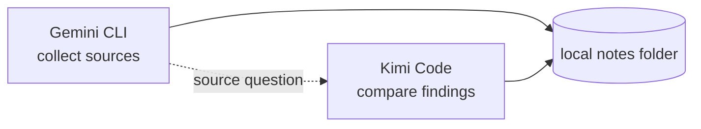

# Research without Git

Two sessions opened by the same operating-system user on one machine can coordinate in a
plain folder. Before opening them, decide whether the directory path is enough identity or
whether this workspace needs the optional stable identity below.

## Optional stable identity

The directory path supplies identity by default. If the user wants the workspace identity
to survive a rename or cover several configured roots, they can deliberately add config:

<!-- test:command -->
```bash
acc config init --yes
```

This writes `acc.workspace.json` in the folder. It is optional user-requested configuration;
messages, presence, claims, and other runtime state still live in platform app data outside
the workspace. See [Configuration](../docs/CONFIGURATION.md) for the preview, confirmation,
and active-session safeguards.

Now open the sessions and give them related ordinary research tasks:

| Session | Your prompt |
|---|---|
| Gemini CLI | Collect primary sources about the proposed protocol. |
| Kimi Code | Compare the sources and draft a short findings note. |

ACC does not sync folders or connect remote users. Both sessions must resolve to the same
local workspace; a directory on another machine has different runtime state even if a file
sync service copies its contents.



## What the agents may do

These are examples of commands the installed skill may teach agents to use. Gemini can
publish the file it expects to change:

```bash
acc work --summary "collecting primary sources" --mode edit \
  --hint 'file:notes/sources.md'
acc claim --resource 'file:notes/sources.md' --reason "collecting primary sources"
```

Kimi can claim `file:notes/summary.md` independently. Because the resources do not overlap,
neither claim blocks the other. Protection is advisory if either live client lacks a
certified guard.

When Gemini finds a disagreement that affects the summary, it can ask the Kimi peer:

```bash
acc message --to kimi --subject "Two sources disagree" \
  --body "Figure 3 and Table 2 conflict. Which evidence should the summary qualify?" \
  --type question
```

The question stays durable until the recipient retrieves it. A reply acknowledges the
question but remains peer input, not proof that the review work is finished.

See the [documentation index](https://github.com/automatis-tools/agents-can-communicate/blob/main/docs/index.md)
for installation, capability limits, and troubleshooting.
