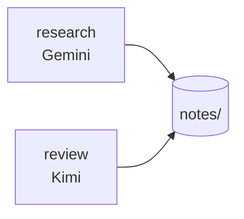

# Research with no repository

A folder of notes. No Git, no branches, no commits — two agents still need to
divide the work and stay out of each other's way.



ACC identifies the workspace by the directory itself, so nothing below changes
without Git.

## A stable identity

<!-- test:command -->
```bash
acc config init --yes
```

Writes `acc.workspace.json` with an id that survives a rename or a move —
without Git, this file is what carries identity.

## Claim before you write

```bash
acc claim --resource 'file:notes/sources.md' --reason "collecting sources"
```

The reviewer claims `file:notes/summary.md` the same way. Two claims, two
files, no collision.

## Hand over a finding

```bash
acc message --to review --subject "Two sources disagree" \
  --body "Fig. 3 vs Table 2 — which do we trust?" --type question
```

The `question` kind stays open until review answers it.

## Check the room

```bash
acc status
```

```text
2 live; 2 claim(s); protection advisory
```

No Git errors, no files written into the folder — coordination state lives
under the platform data directory, reachable with just `acc install`.

See [the docs index](../docs/index.md) for the rest.
