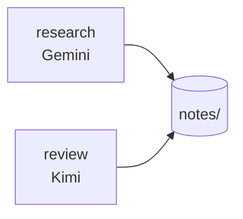

# Research with no repository

A folder of notes. No Git, no branches, no commits.



ACC identifies the workspace by the directory itself. Everything works the same.

## Give it a stable identity

Optional, and worth it if the folder ever moves or is shared:

<!-- test:command -->
```bash
acc config init --yes
```

Writes `acc.workspace.json` with an id that survives a rename.

## Divide the work

```bash
acc claim --session "$ACC_SESSION" --generation "$ACC_GENERATION" \
  --resource 'file:notes/sources.md' --reason "collecting sources"
```

The reviewer claims `file:notes/summary.md`. Neither overwrites the other.

## Hand over a finding

```bash
acc message --session "$ACC_SESSION" --generation "$ACC_GENERATION" \
  --to review --subject "Two sources disagree" \
  --body "Fig. 3 vs Table 2 — which do we trust?" --type question --requires-ack
```

## What you will not see

- no Git errors — the probe finds nothing and that is a normal answer;
- nothing written into the folder — coordination state lives under the platform data
  directory;
- no setup beyond `acc install`.

```bash
acc status
```

```text
2 live; 2 claim(s); protection advisory
```
