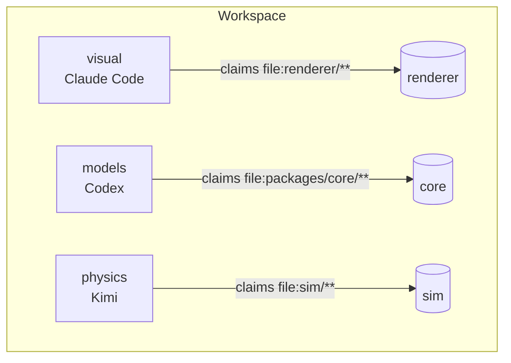
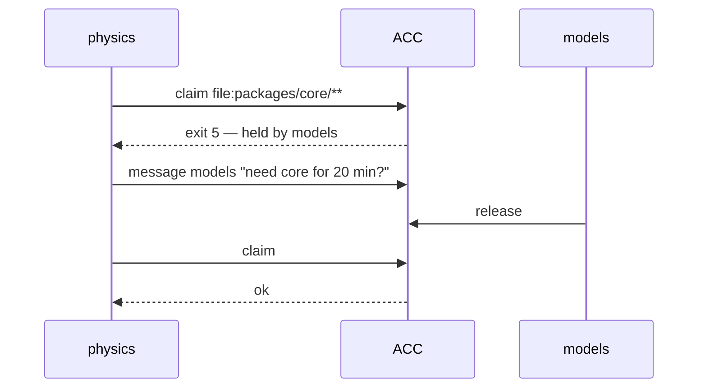

# Three workstreams, one repo

Visual, models, and physics — different people, different clients, same checkout.



Claims are **workspace-global**. Independent workstreams still cannot write over each
other.

## What each session does

```bash
acc work --session "$ACC_SESSION" --generation "$ACC_GENERATION" \
  --summary "porting the material slots" --mode edit

acc claim --session "$ACC_SESSION" --generation "$ACC_GENERATION" \
  --resource 'file:packages/core/**' --enforcement guarded --reason "porting"
```

## When two want the same thing



Nobody is in charge. The conflict is surfaced; the humans and agents settle it.

## Asking across workstreams

Any session can answer for the whole workspace:

```bash
acc sync --session "$ACC_SESSION" --scope full --json
```

"What is physics doing?" is answerable from visual's session. Authority differs;
knowledge does not.

## Ending

```bash
acc finish --session "$ACC_SESSION" --generation "$ACC_GENERATION" \
  --goal "port the material slots" --status partial \
  --completed "slots ported" --remaining "physics review"
```

Writes the handoff and releases the claims — while the session is still working, because a
session-end hook cannot summarise a conversation that has already stopped.
