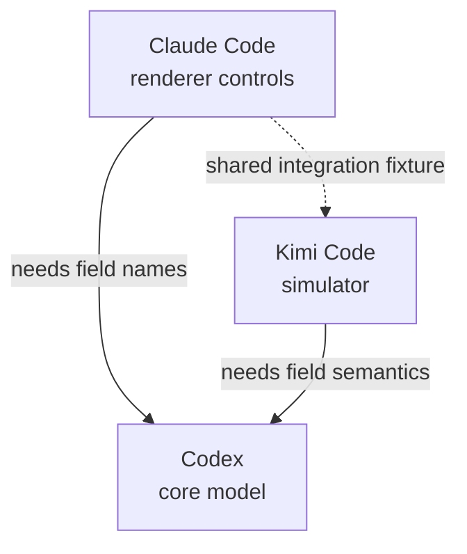

# Three agents, one repository

Open three sessions in worktrees of the same repository and give them related tasks:

| Session | Your prompt |
|---|---|
| Claude Code | Add material controls to the renderer. |
| Codex | Add material fields to the core model. |
| Kimi Code | Make the simulator consume the new material fields. |

The prompts describe the work, not the coordination. ACC's integrations tell the agents
about their peers; each agent decides which dependencies need a conversation.



Git worktrees share the ACC workspace because they share a Git common directory. Their
checkout files and branches remain separate.

## What the agents may do

The following commands are examples of agent activity, not setup steps for the user. Each
agent's installed skill teaches it to publish a narrow intent before editing:

```bash
acc work --summary "adding material fields" --mode edit \
  --hint 'file:packages/core/**'
acc claim --resource 'file:packages/core/**' --reason "adding material fields"
```

A claim makes overlap visible. It is `guarded` only when every relevant live client exposes
a certified write guard; otherwise it is advisory. Claims do not prevent unrelated local
processes from writing, and different files are not automatically in conflict.

When Claude needs the model shape, it can address the Codex peer by client name:

```bash
acc message --to codex --type question --subject "material field contract" \
  --body "Which names and units should the renderer use?"
```

If two Codex sessions are live, `codex` is ambiguous. The asking agent reads the roster in
`acc status --json` and uses the exact participant id instead. A reply stays in the same
thread and acknowledges the question; it does not prove the implementation is complete.

If Kimi later needs a fixture Claude has claimed, its claim exits `5` and names the holder.
The agents can narrow their work or agree on a handoff. No ACC coordinator arbitrates the
decision.

```bash
acc finish --goal "add material fields" --status partial \
  --completed "core shape exported" --remaining "simulator validation"
```

`finish` records the handoff and releases that session's claims while the agent can still
speak for its own work.

See the [documentation index](https://github.com/automatis-tools/agents-can-communicate/blob/main/docs/index.md)
for the rest of the guide.
