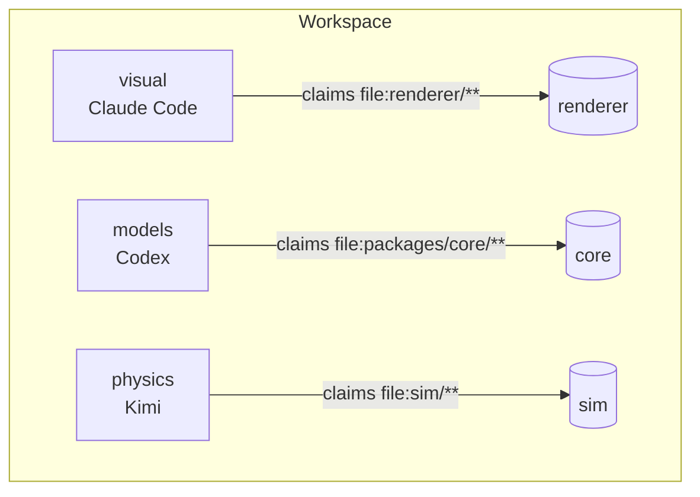
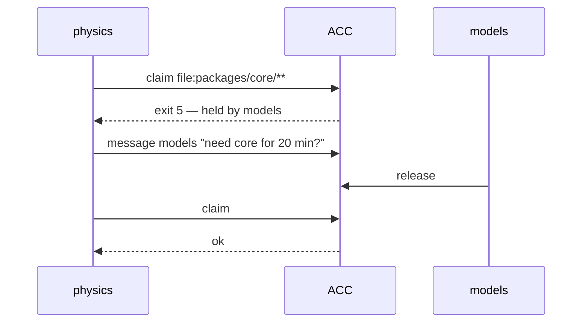

# Three workstreams, one repo

Visual, models, and physics — three clients, one checkout.



Claims are workspace-global, so even workstreams that never touch each other's
files still can't step on one another.

## What each session does

Publish intent, then claim the directory:

```bash
acc work --summary "porting the material slots" --mode edit

acc claim --resource 'file:packages/core/**' --enforcement guarded --reason "porting"
```

## When two want the same thing



A conflict is a race, not an error: `claim` exits `5` and names the holder,
physics messages models directly, models releases, physics claims again.
Nobody arbitrates — the sessions settle it themselves.

## Asking across workstreams

Any session can answer for the whole workspace:

```bash
acc sync --scope full --json
```

"What is physics doing?" is answerable from visual's session — authority is
scoped per claim, knowledge isn't.

## Ending

```bash
acc finish --goal "port the material slots" --status partial \
  --completed "slots ported" --remaining "physics review"
```

`finish` writes the handoff and releases the claims while the session can
still speak for itself — a hook firing after the session has already stopped
can't summarise a conversation it never saw.

See [`../docs/index.md`](../docs/index.md) for the rest of the docs.
